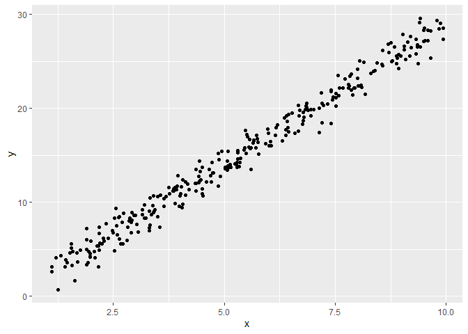
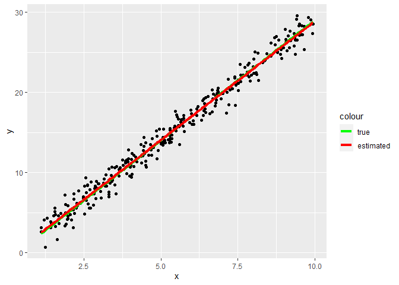

Linear Regression
================

#### simple linear regression

``` r
library(ggplot2)
library(dplyr)

n = 300
set.seed(1)
x = runif(n,min = 1,max = 10)
y = -1 + 3 * x + rnorm(n, 0, 1)

ggplot() + geom_point(aes(x, y))
```

<!-- -->

#### estimate of true beta

``` r
X = cbind(1, x)
(beta = solve(t(X) %*% X) %*% t(X) %*% y)
```

    ##         [,1]
    ##   -0.8195023
    ## x  2.9702793

``` r
ggplot() + geom_point(aes(x, y)) + 
  geom_line(aes(x, -1 + 3 * x, color = 'true'), lwd = 1.5) + 
  geom_line(aes(x, X %*% beta, color = 'estimated'),
            lwd = 1.5) + 
  scale_color_manual(breaks = c('true','estimated'),
                      values = c('green', 'red'))
```

<!-- -->

``` r
# R built-in function 
lm(y~x)$coefficients
```

    ## (Intercept)           x 
    ##  -0.8195023   2.9702793
